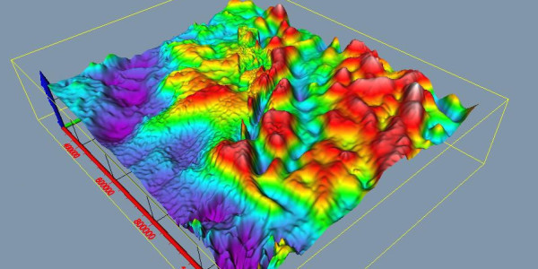

# Geofisica
La **geofísica** es una ciencia derivada de la geología que trata del estudio de las propiedades físicas de la `Tierra`. Comprende aspectos como la investigación de la composición interna del planeta, el flujo de *calor* proveniente del interior de la ~~Tierra~~ 

---
## metodo geofisico
### Gravimetria

---
# Metodos
|metodo|Parametro|Aplicacion|
|---|---|---|
|Electrico|Resistividad|Deteccion sulfuros|

